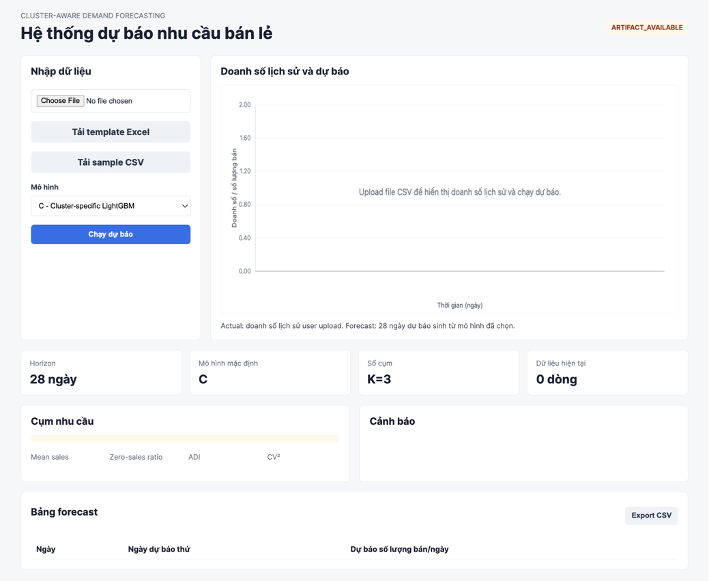
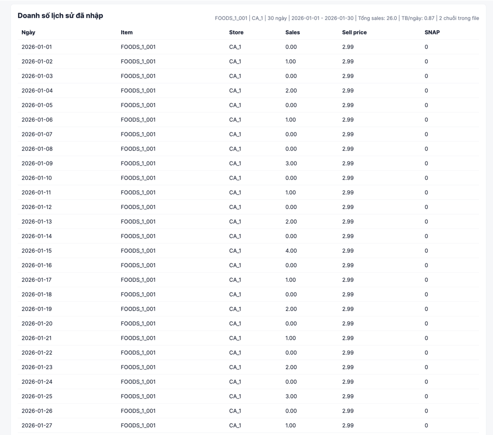
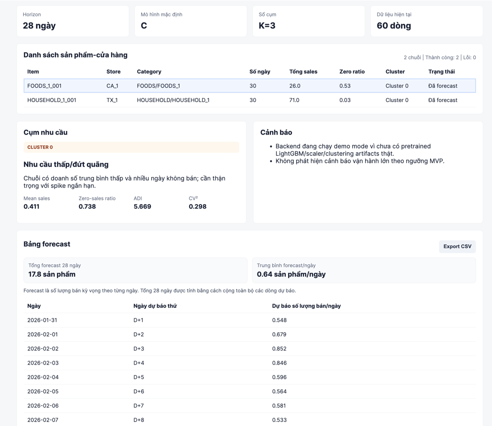
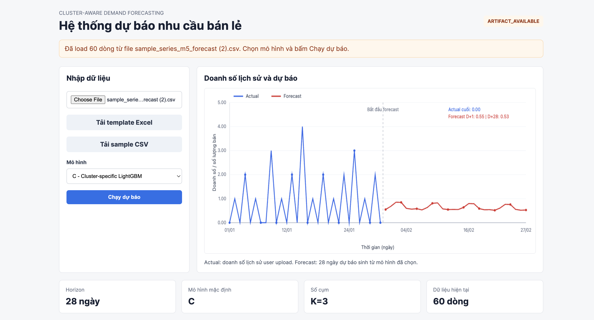

# Forecast M5 Research and MVP Application

This repository contains two separate work areas:

- `research/` or the existing research scripts/configs/outputs used for the M5 cluster-aware forecasting study.
- `app/` for the MVP web application that runs inference from pretrained artifacts.

The MVP application lets a user upload retail sales history for one or many item-store series, choose model A0/B1/C, and receive a 28-day demand forecast with per-series cluster interpretation and operational warnings.

Large M5 data files, experiment outputs, and heavy model artifacts should not be committed directly. Put production inference artifacts under `app/artifacts/` locally, or use Git LFS/release assets if they must be shared.

## Run the MVP app locally

```bash
python -m venv .venv
source .venv/bin/activate
pip install -r app/backend/requirements.txt
PYTHONPATH=app/backend python -m uvicorn app.main:app --host 127.0.0.1 --port 8000
```

Open:

```text
http://127.0.0.1:8000
```

## Application screenshots

### Home page and data upload

The home page lets users download the Excel template, download a sample CSV, upload sales history, and select the forecasting model.



### Uploaded historical sales

After a CSV upload, the app identifies each item-store series, summarizes historical sales, and lets the user select which series to inspect.



### Forecast result and cluster interpretation

The forecast view displays the selected series, its demand cluster, operational warnings, actual-vs-forecast chart, and the daily forecast table.



### Forecast summary

The result table clarifies that each forecast value is a daily expected sales quantity and adds total expected demand for the 28-day horizon.



## Recreate app artifacts

After running the research pipeline that produces a compatible output folder:

```bash
APP_ARTIFACT_SOURCE_RUN=outputs_app_artifact_origin1913_tweedie_a0_b1_c \
python scripts/export_app_artifacts.py
```
